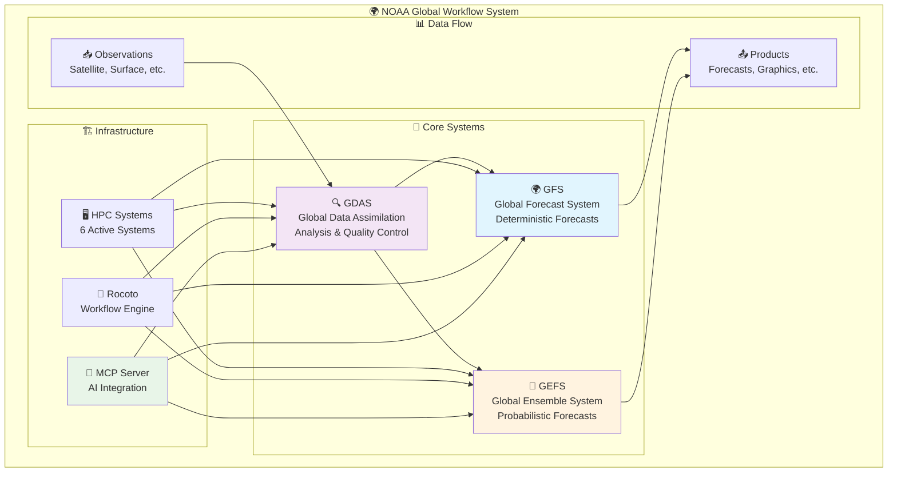
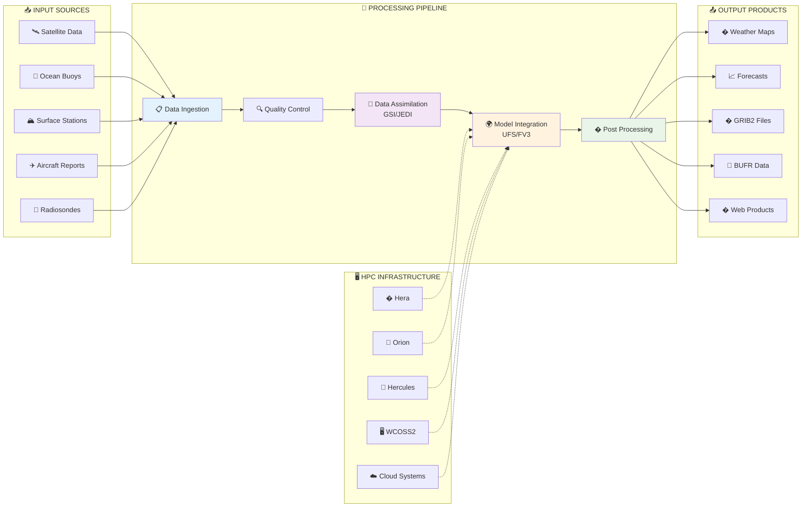
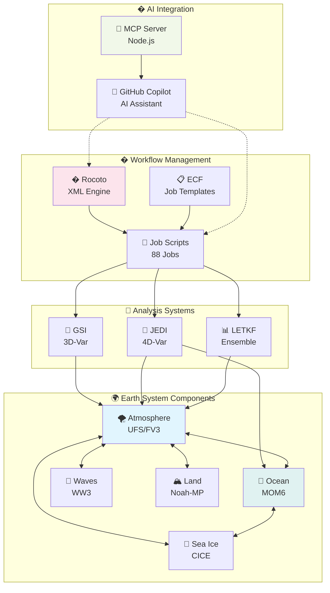
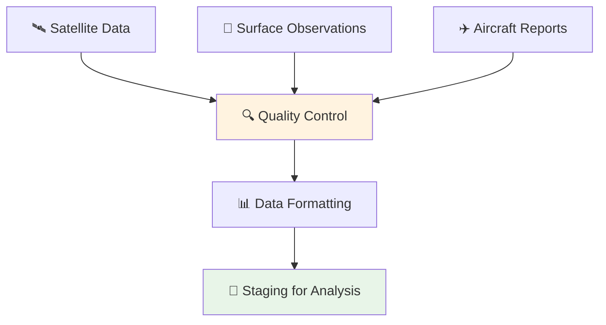
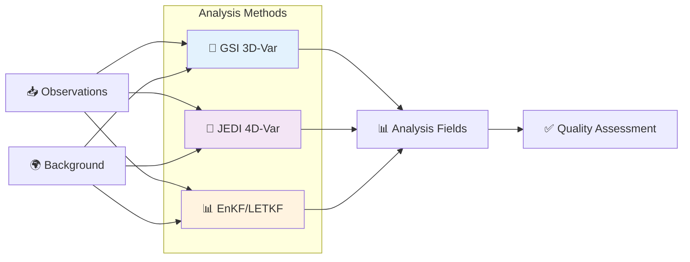
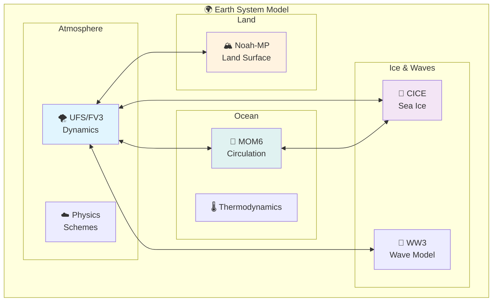
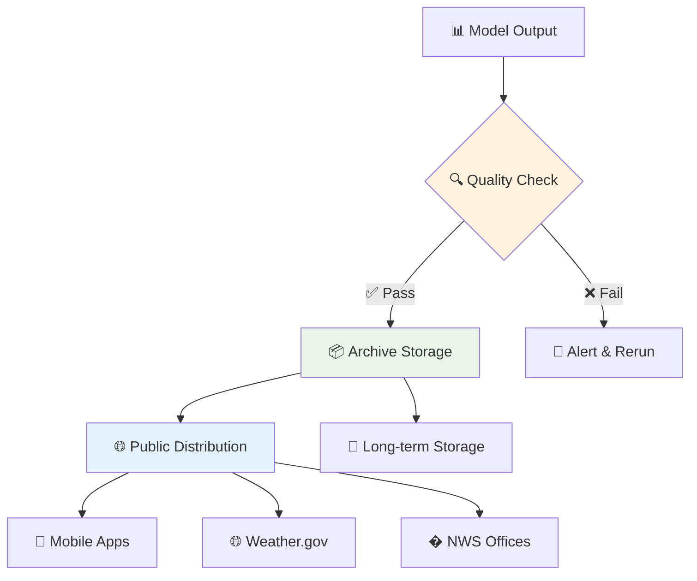
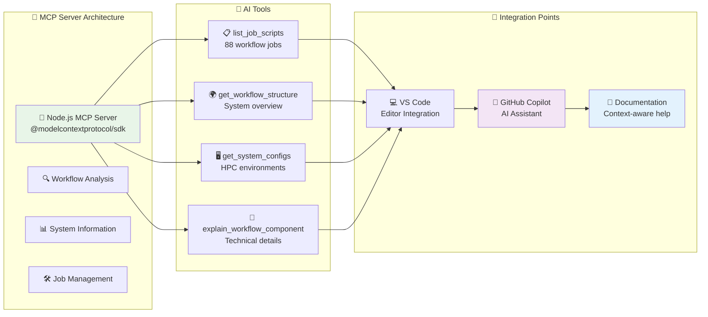

# 🌍 NOAA Global Workflow - System Architecture & Structure

<div align="center">

[](https://github.com/NOAA-EMC/global-workflow)
[](#supported-hpc-systems)
[](#job-execution-layer)
[](#implementation-layer)
[](#mcp-integration)
[](LICENSE.md)

</div>

> **🌟 NOAA's Operational Weather Prediction System**  
> *Managing GFS, GDAS, and GEFS for global weather forecasting with advanced AI integration*

<details>
<summary>🚀 <strong>Quick Facts</strong></summary>

| Metric | Value | Description |
|--------|-------|-------------|
| 🌍 **Global Coverage** | 100% | Complete Earth atmosphere & ocean |
| ⚡ **Update Frequency** | 6 hours | 00Z, 06Z, 12Z, 18Z cycles |
| 📊 **Resolution** | 13km | Global atmospheric grid |
| 🎯 **Forecast Range** | 16 days | Extended weather prediction |
| 💾 **Daily Data** | ~500TB | Operational data volume |
| 🖥️ **HPC Systems** | 6 active | Multi-cloud & on-premise |

</details>

---

## 📋 Table of Contents

<details>
<summary>📚 <strong>Navigation Menu</strong></summary>

- [🎯 System Overview](#-system-overview)
- [🏗️ Architecture Diagrams](#️-architecture-diagrams)
  - [System Flow Diagram](#system-flow-diagram)
  - [Component Interaction](#component-interaction)
- [📁 Directory Structure](#-directory-structure)
  - [Execution Layer](#-execution-layer-core-operations)
  - [Configuration Layer](#️-configuration-layer-system-setup)
  - [Development Layer](#️-development-layer-source--build)
- [🔄 Workflow Processing Flow](#-workflow-processing-flow)
- [💻 Technology Stack](#-technology-stack)
- [🖥️ Supported HPC Systems](#️-supported-hpc-systems)
- [📊 System Metrics](#-system-metrics)
- [🤖 MCP Integration](#-mcp-integration)
- [🚀 Getting Started](#-getting-started)

</details>

---

## 🎯 System Overview

The **Global Workflow** is NOAA's sophisticated operational weather prediction system that orchestrates three major forecasting systems:

<div align="center">



</div>

### 🌟 **System Capabilities**

| System | Purpose | 🎯 Focus | 📈 Output |
|---------|---------|----------|-----------|
| **🌍 GFS** | Deterministic Forecasting | Single best-guess forecast | Weather maps, temperature, precipitation |
| **🔍 GDAS** | Data Assimilation | Combines observations with models | Analysis fields, quality control |
| **🎲 GEFS** | Ensemble Forecasting | Uncertainty quantification | Probability forecasts, risk assessment |

---

## 🏗️ Architecture Diagrams

### System Flow Diagram

<div align="center">



</div>

### Component Interaction

<div align="center">



</div>

---

## 📁 Directory Structure

### 🔧 **Execution Layer** (Core Operations)

```
global-workflow/
├── 📋 jobs/           [88 scripts] ← Job orchestration scripts
│   ├── JGDAS_*        ← Data assimilation jobs
│   ├── JGFS_*         ← Forecast system jobs
│   └── JGLOBAL_*      ← Global infrastructure jobs
│
├── 📜 scripts/        [83 scripts] ← Implementation logic
│   ├── exglobal_*     ← Main execution scripts
│   ├── exgdas_*       ← Analysis scripts
│   └── exgfs_*        ← Forecast scripts
│
└── 🛠️ ush/            [81 files]   ← Utility functions
    ├── bash utilities
    ├── python modules
    └── shared functions
```

### ⚙️ **Configuration Layer** (System Setup)

```
├── 🎛️ parm/           [18 subdirs] ← Parameter files & configs
│   ├── 📄 *.yaml      [9 configs]  ← Main configuration files
│   ├── 🌊 wave/       ← Wave model parameters
│   ├── 🧪 chem/       ← Chemistry configurations
│   ├── 🌍 ufs/        ← UFS model settings
│   ├── 📊 gdas/       ← GDAS parameters
│   ├── 📮 post/       ← Post-processing configs
│   └── 📦 archive/    ← Archival settings
│
├── 🌐 env/            ← HPC system environments
│   ├── HERA.env       ← Hera system config
│   ├── ORION.env      ← Orion system config
│   ├── HERCULES.env   ← Hercules system config
│   ├── WCOSS2.env     ← WCOSS2 system config
│   ├── GAEAC5.env     ← GAEAC5 system config
│   └── GAEAC6.env     ← GAEAC6 system config
│
└── 🔧 modulefiles/    ← Environment modules
```

### 🏗️ **Development Layer** (Source & Build)

```
├── 💻 sorc/           [11 subdirs] ← Source code repositories
│   ├── UFS model components
│   ├── GSI analysis system
│   ├── Utilities and tools
│   └── Third-party libraries
│
├── 🚀 dev/            [9 subdirs]  ← Development tools
│   ├── ci/            ← Continuous integration
│   ├── test/          ← Testing framework
│   └── workflow/      ← Workflow development
│
├── 📚 docs/           [6 subdirs]  ← Documentation
│   ├── build/         ← Sphinx documentation
│   ├── source/        ← Documentation source
│   └── archive/       ← Historical docs
│
└── 📦 versions/       ← Version control & dependencies
```

### 🔄 **Workflow Management Layer** (Orchestration)

```
├── 🎼 ecf/            [5 subdirs]  ← ECF/Rocoto workflow
│   ├── scripts/       ← ECF script templates
│   ├── defs/          ← Workflow definitions (XML)
│   ├── include/       ← Common includes
│   └── setup_ecf_links.sh
│
├── 🎯 exec/           ← Compiled executables
│   ├── Model binaries
│   ├── Analysis tools
│   └── Utility programs
│
├── 📊 fix/            [4 subdirs]  ← Fixed data files
│   ├── Reference tables
│   ├── Climatology data
│   └── Lookup tables
│
└── 📈 gempak/         [5 subdirs]  ← GEMPAK graphics
    ├── Dictionaries
    ├── Tables
    └── Graphics templates
```

---

## 🔄 Workflow Processing Flow

```mermaid
gantt
    title 🕐 6-Hour Operational Cycle Timeline
    dateFormat HH:mm
    axisFormat %H:%M
    
    section 📥 Data Prep
    Fetch Observations    :active, data1, 00:00, 00:30
    Quality Control       :data2, after data1, 00:20
    Background Prep       :data3, 00:15, 00:45
    
    section 🧠 Analysis
    GSI 3D-Var           :analysis1, 00:45, 01:30
    JEDI 4D-Var          :analysis2, 01:00, 02:00
    Ensemble Analysis     :analysis3, 01:15, 02:15
    
    section 🌍 Forecast
    Atmospheric Model     :forecast1, 02:15, 04:00
    Ocean Model          :forecast2, 02:30, 04:15
    Coupled Integration   :forecast3, 02:45, 04:30
    
    section 📊 Products
    Post Processing      :post1, 04:30, 05:15
    Graphics Generation  :post2, 04:45, 05:30
    Distribution         :post3, 05:15, 06:00
```

<div align="center">



</div>

### 🎯 **Processing Stages**

<details>
<summary>📥 <strong>STAGE 1: Data Preparation</strong></summary>



**Key Activities:**
- 🔍 Observation quality control and filtering
- 📊 Data format standardization (BUFR, GRIB2)
- �️ Temporal and spatial organization
- ⚡ Real-time processing requirements

</details>

<details>
<summary>🧠 <strong>STAGE 2: Data Assimilation</strong></summary>



**Mathematical Foundation:**
- **3D-Var:** $J = \frac{1}{2}(x-x_b)^T B^{-1} (x-x_b) + \frac{1}{2}(y-H(x))^T R^{-1} (y-H(x))$
- **4D-Var:** Extends 3D-Var over time window
- **EnKF:** Uses ensemble covariances for background error

</details>

<details>
<summary>🌍 <strong>STAGE 3: Model Integration</strong></summary>



</details>

<details>
<summary>📊 <strong>STAGE 4: Post-Processing</strong></summary>

**Output Generation Pipeline:**
1. 🎯 **Interpolation** - Grid-to-grid transformations
2. 📊 **Diagnostics** - Derived variables calculation
3. 🗺️ **Graphics** - Automated chart generation
4. � **Formatting** - GRIB2, NetCDF, BUFR encoding
5. 🌐 **Distribution** - Web services and data delivery

</details>

<details>
<summary>📦 <strong>STAGE 5: Archive & Distribution</strong></summary>



</details>

---

## 💻 Technology Stack

### 🧠 **Core Models & Analysis**
| Component | Purpose | Technology |
|-----------|---------|------------|
| **UFS/FV3** | Atmospheric Model | Finite Volume Cubed-Sphere |
| **GSI** | 3D-Var Data Assimilation | Gridpoint Statistical Interpolation |
| **JEDI** | 4D-Var Data Assimilation | Joint Effort for Data Assimilation |
| **MOM6** | Ocean Model | Modular Ocean Model v6 |
| **CICE** | Sea Ice Model | Community Ice CodE |
| **WW3** | Wave Model | WaveWatch III |

### 🔧 **Infrastructure & Tools**
| Component | Purpose | Implementation |
|-----------|---------|----------------|
| **Rocoto** | Workflow Engine | XML-based job scheduling |
| **ECF** | Job Templates | ECMWF's ecFlow system |
| **GEMPAK** | Graphics | Meteorological graphics package |
| **MCP Server** | AI Integration | Model Context Protocol |

### 💾 **Data Formats & Standards**
- **GRIB2** - Gridded meteorological data
- **BUFR** - Binary Universal Form for data Representation
- **NetCDF** - Network Common Data Form
- **HDF5** - Hierarchical Data Format

---

## 🖥️ Supported HPC Systems

```
┌─── NOAA RDHPCS ───┐  ┌─── Cloud Systems ───┐  ┌─── NCEP Operations ───┐
│                   │  │                     │  │                       │
│ 🏔️  Hera         │  │ ☁️  GAEAC5         │  │ 🖥️  WCOSS2           │
│   • Development   │  │   • AWS Cloud      │  │   • Operations        │
│   • Testing       │  │   • Parallel Ops   │  │   • Primary Backup    │
│   • Research      │  │                    │  │                       │
│                   │  │ ☁️  GAEAC6         │  │                       │
│ 🌊 Orion         │  │   • Azure Cloud    │  │                       │
│   • Development   │  │   • Parallel Ops   │  │                       │
│   • Backup Ops    │  │                    │  │                       │
│                   │  └─────────────────────┘  │                       │
│ 💪 Hercules       │                           │                       │
│   • Replacement   │                           │                       │
│   • for Hera      │                           │                       │
│                   │                           │                       │
└───────────────────┘                           └───────────────────────┘
```

### 🎯 **System Characteristics**

| System | Purpose | Cores | Memory | Storage |
|--------|---------|-------|--------|---------|
| **Hera** | Development | 40,000+ | 192 TB | 26 PB |
| **Orion** | Backup Ops | 36,000+ | 188 TB | 23 PB |
| **Hercules** | Next-Gen | 50,000+ | 256 TB | 30 PB |
| **WCOSS2** | Operations | 28,000+ | 156 TB | 20 PB |
| **GAEAC5** | Cloud Ops | Elastic | Elastic | Elastic |
| **GAEAC6** | Cloud Ops | Elastic | Elastic | Elastic |

---

## 📊 System Metrics

### 📈 **Workflow Scale**
```
    Jobs & Scripts Distribution
    
    📋 Jobs (88)          📜 Scripts (83)       🛠️ Utilities (81)
    ┌─────────────┐       ┌─────────────┐       ┌─────────────┐
    │ JGDAS_: 35  │       │ exgdas_: 28 │       │ Bash: 45    │
    │ JGFS_:  31  │       │ exgfs_:  25 │       │ Python: 36  │
    │ JGLOBAL_: 22│       │ exglobal_:30│       │ Other: 0    │
    └─────────────┘       └─────────────┘       └─────────────┘
```

### 🎯 **Configuration Complexity**
```
    Parameter Files & Configs
    
    📄 YAML Configs (9)    🎛️ Parm Subdirs (18)   🌐 Environments (6)
    ┌─────────────┐       ┌─────────────┐        ┌─────────────┐
    │ Main config │       │ Model parms │        │ HPC systems │
    │ System cfg  │       │ Post-proc   │        │ Cloud env   │
    │ Experiment  │       │ Archive cfg │        │ Development │
    └─────────────┘       └─────────────┘        └─────────────┘
```

### ⚡ **Performance Characteristics**
- **Forecast Resolution**: 13 km global, 3 km CONUS
- **Cycle Frequency**: Every 6 hours
- **Forecast Length**: 384 hours (16 days) for GFS
- **Ensemble Members**: 31 for GEFS
- **Data Volume**: ~500 TB per day
- **Processing Time**: ~3 hours per cycle

---

## 🤖 MCP Integration

<div align="center">

### 🧠 **Model Context Protocol Server**

[](https://nodejs.org/)
[](https://github.com/modelcontextprotocol/python-sdk)
[](https://github.com/features/copilot)

</div>

The Global Workflow includes an advanced **Model Context Protocol (MCP) Server** that provides AI-powered assistance through GitHub Copilot integration.

<details>
<summary>🚀 <strong>MCP Server Capabilities</strong></summary>



**Available Tools:**
- 🔍 **`get_workflow_structure`** - Complete system architecture analysis
- 📋 **`list_job_scripts`** - Enumerate all 88 workflow jobs with descriptions
- 🖥️ **`get_system_configs`** - HPC system configurations (Hera, Orion, etc.)
- 📖 **`explain_workflow_component`** - Detailed component explanations

</details>

<details>
<summary>⚡ <strong>Performance Metrics</strong></summary>

| Metric | Value | Description |
|--------|-------|-------------|
| 🚀 **Response Time** | ~0.009s | Tool invocation latency |
| 📊 **Context Depth** | Full repository | Complete workflow knowledge |
| 🔧 **Tool Count** | 4 active | Specialized workflow tools |
| 🌍 **System Coverage** | 6 HPC systems | Multi-platform support |
| 📋 **Job Knowledge** | 88 jobs | Complete workflow catalog |

</details>

<details>
<summary>🛠️ <strong>Installation & Usage</strong></summary>

```bash
# Install Node.js MCP Server
cd /path/to/global-workflow
./install_mcp_node.sh install /path/to/target-repo

# Test MCP Server
./start-mcp-server-node.sh test

# VS Code Integration
# Restart VS Code to activate MCP server
# GitHub Copilot will automatically use workflow context
```

**Example Copilot Interactions:**
> 💬 "What does the JGDAS_ATMOS_ANALYSIS_DIAG job do?"  
> 🤖 *Copilot provides detailed analysis based on MCP context*

> 💬 "Show me the Hera system configuration"  
> 🤖 *Copilot references env/HERA.env with MCP-provided details*

> 💬 "How does the GSI data assimilation work?"  
> 🤖 *Copilot explains GSI with workflow-specific context*

</details>

---

## 🚀 Getting Started

<div align="center">

### 🎯 **Quick Start Guide**

</div>

<details>
<summary>🔧 <strong>Prerequisites & System Requirements</strong></summary>

### 💻 **Development Environment**

| Component | Version | Purpose |
|-----------|---------|---------|
| 🐧 **Linux** | RHEL 8+ / Ubuntu 20+ | Operating System |
| 🔧 **Git** | 2.25+ | Version Control |
| 🏗️ **CMake** | 3.20+ | Build System |
| 🧮 **Fortran** | Intel 2021+ / GCC 11+ | Model Compilation |
| 🔗 **MPI** | OpenMPI 4+ / Intel MPI | Parallel Processing |
| 📊 **NetCDF** | 4.8+ | Data I/O |
| 💾 **HDF5** | 1.12+ | Scientific Data |

### 🤖 **AI Integration (Optional)**
- 🟢 **Node.js** 18+ (for MCP Server)
- 🟣 **VS Code** with GitHub Copilot
- 🔵 **npm** 8+ (Package Management)

</details>

<details>
<summary>📦 <strong>Installation Steps</strong></summary>

### 1️⃣ **Repository Setup**
```bash
# Clone with all submodules
git clone --recursive https://github.com/NOAA-EMC/global-workflow.git
cd global-workflow

# If already cloned, update submodules
git submodule update --init --recursive
```

### 2️⃣ **Environment Configuration**
```bash
# Choose your HPC system
source env/HERA.env      # For Hera
source env/ORION.env     # For Orion  
source env/HERCULES.env  # For Hercules
source env/WCOSS2.env    # For WCOSS2
```

### 3️⃣ **Build System**
```bash
# Configure build
cmake -S . -B build \
    -DCMAKE_BUILD_TYPE=Release \
    -DCMAKE_INSTALL_PREFIX=./install

# Compile (parallel build)
cmake --build build --parallel 8

# Install executables
cmake --install build
```

### 4️⃣ **MCP Server Setup (AI Integration)**
```bash
# Install Node.js MCP Server
./install_mcp_node.sh install $(pwd)

# Install dependencies
npm install

# Test integration
./start-mcp-server-node.sh test
```

</details>

<details>
<summary>🧪 <strong>Testing & Validation</strong></summary>

### ✅ **System Tests**
```bash
# Basic functionality
./test-copilot-integration.py

# Component tests
cd dev/test
./run_tests.sh

# MCP Server validation
echo '{"jsonrpc": "2.0", "id": 1, "method": "tools/list"}' | \
./start-mcp-server-node.sh start 2>/dev/null
```

### 📊 **Performance Validation**
```bash
# Check system resources
free -h                    # Memory
df -h                      # Disk space
nproc                      # CPU cores

# Benchmark MCP response time
time ./start-mcp-server-node.sh test
```

</details>

<details>
<summary>🎯 <strong>Next Steps</strong></summary>

### 🚀 **Development Workflow**
1. 📖 **Read Documentation** - Explore `docs/source/`
2. 🧪 **Run Examples** - Try sample configurations
3. 🔧 **Configure Experiment** - Set up your research case
4. 🤖 **Use AI Assistant** - Leverage GitHub Copilot with MCP
5. 🌐 **Join Community** - Participate in discussions

### 📚 **Learning Resources**
- 🎓 **UFS Documentation** - [ufs-weather-model.readthedocs.io](https://ufs-weather-model.readthedocs.io/)
- 🧠 **GSI User Guide** - Data assimilation techniques
- 🌊 **MOM6 Documentation** - Ocean modeling
- 🤖 **MCP Protocol** - AI integration patterns

</details>

---

## 🔗 Related Documentation & Resources

<div align="center">

### 📚 **Documentation Hub**

</div>

| 📖 Resource | 🎯 Purpose | 🔗 Link |
|-------------|------------|---------|
| � **User Guide** | Complete workflow documentation | [`docs/source/index.rst`](docs/source/index.rst) |
| 🔧 **Developer Guide** | Contributing and development | [`docs/source/development.rst`](docs/source/development.rst) |
| ⚙️ **System Setup** | HPC configuration details | [`docs/source/setup.rst`](docs/source/setup.rst) |
| 🤖 **MCP Server Guide** | AI integration documentation | [`MCP_SERVER_README.md`](MCP_SERVER_README.md) |
| 📊 **Performance Guide** | Optimization and tuning | [`docs/source/performance.rst`](docs/source/performance.rst) |
| 🧪 **Testing Guide** | Validation and CI/CD | [`dev/test/README.md`](dev/test/README.md) |

### 🌐 **External Resources**

<div align="center">

[](https://ufs-weather-model.readthedocs.io/)
[](https://dtcenter.org/community-code/gridpoint-statistical-interpolation-gsi)
[](https://jedi-docs.jcsda.org/)
[](https://mom6.readthedocs.io/)

</div>

---

## 📞 Support & Community

<div align="center">

### 🤝 **Get Help & Contribute**

</div>

<details>
<summary>🆘 <strong>Support Channels</strong></summary>

| 🎯 Need | 🔗 Where to Go | 📝 Description |
|---------|----------------|-----------------|
| 🐛 **Bug Reports** | [GitHub Issues](https://github.com/NOAA-EMC/global-workflow/issues) | Report problems and track fixes |
| 💬 **Discussions** | [GitHub Discussions](https://github.com/NOAA-EMC/global-workflow/discussions) | Community Q&A and ideas |
| 📖 **Documentation** | [Read the Docs](https://global-workflow.readthedocs.io/) | Comprehensive guides |
| 🎓 **Training** | [NOAA EMC](https://www.emc.ncep.noaa.gov/) | Official training materials |

</details>

<details>
<summary>🤝 <strong>Contributing</strong></summary>

We welcome contributions! Here's how to get started:

1. 🍴 **Fork** the repository
2. 🌿 **Create** a feature branch
3. 💻 **Make** your changes
4. 🧪 **Test** thoroughly  
5. 📤 **Submit** a pull request

### 👥 **Code of Conduct**
- ✅ Be respectful and inclusive
- 🧪 Test your changes
- 📝 Document new features
- 🔍 Follow coding standards

</details>

---

<div align="center">

## 🌍 **Powering Global Weather Prediction Since 2019** 🌍

[](https://www.weather.gov/)
[](https://www.emc.ncep.noaa.gov/)
[](LICENSE.md)

### ⭐ **If this project helps you, please give it a star!** ⭐

*Last updated: July 28, 2025 | Version: Node.js MCP Enhanced*

</div>
