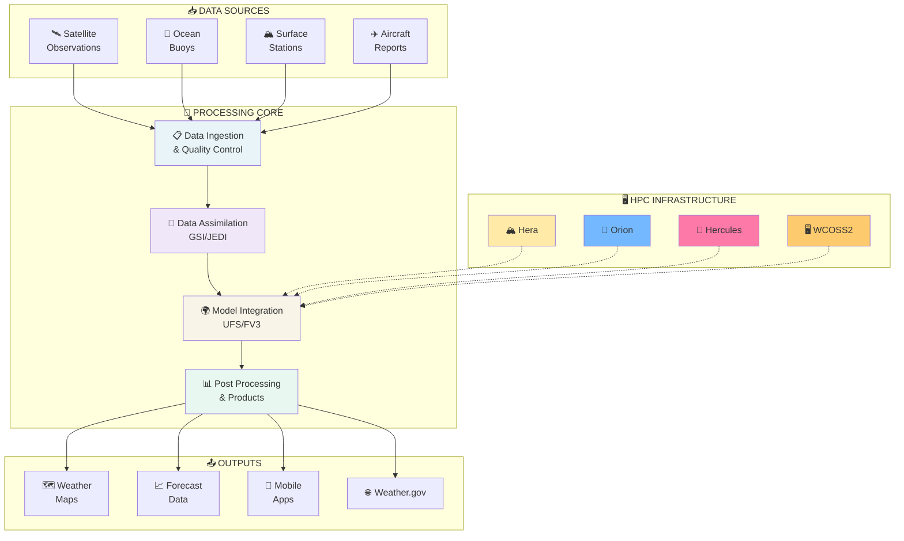
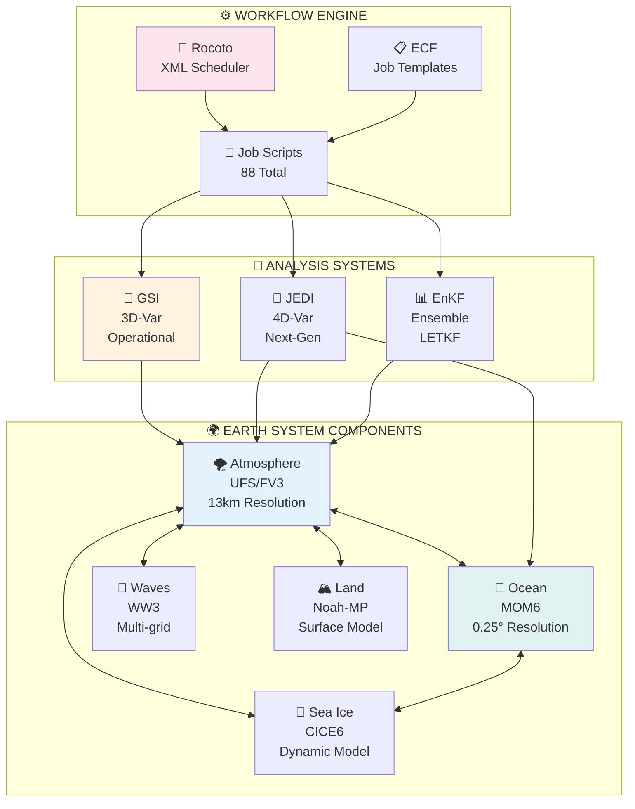

# 🌍 NOAA Global Workflow
## System Architecture & Structure

<div align="center">


[](https://github.com/NOAA-EMC/global-workflow)
[](#supported-hpc-systems)
[](#job-execution-layer)
[](#implementation-layer)
[](#mcp-integration)

</div>

---

<div align="center">

### 🌟 **Advanced Weather Prediction System**
*Orchestrating global forecasting with cutting-edge AI integration*


</div>

---

## 📊 **System Overview**

<div align="center">

<table>
<tr>
<td align="center" width="20%">
<br/>
<strong>100% Earth</strong><br/>
<sub>Complete atmosphere & ocean</sub>
</td>
<td align="center" width="20%">
<br/>
<strong>6 Hours</strong><br/>
<sub>00Z, 06Z, 12Z, 18Z</sub>
</td>
<td align="center" width="20%">
<br/>
<strong>13km Global</strong><br/>
<sub>High-resolution grid</sub>
</td>
<td align="center" width="20%">
<br/>
<strong>16 Days</strong><br/>
<sub>Extended prediction</sub>
</td>
<td align="center" width="20%">
<br/>
<strong>~500TB</strong><br/>
<sub>Operational volume</sub>
</td>
</tr>
</table>

</div>

---

## 🧭 **Navigation**

<div align="center">

| Section | Description | Links |
|---------|-------------|-------|
| **🎯 Core Systems** | Forecast models & capabilities | [GFS](#-core-forecast-systems) • [GDAS](#-core-forecast-systems) • [GEFS](#-core-forecast-systems) |
| **🏗️ Architecture** | System design & workflows | [Diagrams](#️-architecture-diagrams) • [Flow](#-workflow-processing-flow) |
| **📁 Structure** | Directory organization | [Execution](#-execution-layer-core-operations) • [Config](#️-configuration-layer-system-setup) |
| **💻 Technology** | Models & infrastructure | [Stack](#-technology-stack) • [HPC](#️-supported-hpc-systems) |
| **🤖 AI Integration** | MCP Server & Copilot | [Setup](#-mcp-integration) • [Tools](#-mcp-integration) |
| **🚀 Getting Started** | Installation & setup | [Prerequisites](#-getting-started) • [Installation](#-getting-started) |

</div>

---

## 🎯 **Core Forecast Systems**

<div align="center">

### 🌟 **Three Integrated Prediction Systems**

<table>
<tr>
<th align="center" width="33%">
<br/>
<strong>Global Forecast System</strong>
</th>
<th align="center" width="33%">
<br/>
<strong>Global Data Assimilation</strong>
</th>
<th align="center" width="33%">
<br/>
<strong>Global Ensemble System</strong>
</th>
</tr>
<tr>
<td align="center">
🎯 <strong>Deterministic forecasting</strong><br/>
🌡️ Temperature & precipitation<br/>
🗺️ Weather maps & guidance<br/>
📈 Single best-guess prediction
</td>
<td align="center">
🔬 <strong>Analysis & quality control</strong><br/>
🛰️ Observation processing<br/>
📊 Background field generation<br/>
🧠 Data fusion & validation
</td>
<td align="center">
📊 <strong>Probabilistic forecasting</strong><br/>
🎯 Uncertainty quantification<br/>
🌪️ Risk assessment & alerts<br/>
📈 31-member ensemble
</td>
</tr>
</table>

</div>

---

## 🏗️ **Architecture Diagrams**

### System Integration Flow

<div align="center">



</div>

### Component Interactions

<div align="center">



</div>

---

## 📁 **Directory Structure**

### 🎯 **Organized by Function**

<div align="center">

<table>
<tr>
<th align="center" width="50%">
<br/>
<em>Core Operations</em>
</th>
<th align="center" width="50%">
<br/>
<em>System Setup</em>
</th>
</tr>
<tr>
<td>

```
📋 jobs/           [88 scripts]
├── JGDAS_*        ← Analysis jobs
├── JGFS_*         ← Forecast jobs
└── JGLOBAL_*      ← Infrastructure jobs

📜 scripts/        [83 scripts]
├── exglobal_*     ← Main execution
├── exgdas_*       ← Analysis scripts
└── exgfs_*        ← Forecast scripts

🛠️ ush/            [81 files]
├── bash utilities
├── python modules
└── shared functions
```

</td>
<td>

```
🎛️ parm/           [18 subdirs]
├── 📄 *.yaml      [9 configs]
├── 🌊 wave/       ← Wave parameters
├── 🧪 chem/       ← Chemistry configs
└── 🌍 ufs/        ← UFS settings

🌐 env/            [6 systems]
├── HERA.env       ← Development
├── ORION.env      ← Backup ops
├── HERCULES.env   ← Next-gen
├── WCOSS2.env     ← Operations
├── GAEAC5.env     ← AWS Cloud
└── GAEAC6.env     ← Azure Cloud
```

</td>
</tr>
</table>

</div>

### 🏗️ **Development & Build Structure**

<div align="center">

<table>
<tr>
<th align="center" width="50%">
<br/>
<em>Source & Build</em>
</th>
<th align="center" width="50%">
<br/>
<em>Orchestration</em>
</th>
</tr>
<tr>
<td>

```
💻 sorc/           [11 subdirs]
├── UFS model components
├── GSI analysis system
├── Utilities and tools
└── Third-party libraries

🚀 dev/            [9 subdirs]
├── ci/            ← CI/CD
├── test/          ← Testing
└── workflow/      ← Development

📚 docs/           [6 subdirs]
├── build/         ← Sphinx docs
├── source/        ← Doc source
└── archive/       ← Historical
```

</td>
<td>

```
🎼 ecf/            [5 subdirs]
├── scripts/       ← ECF templates
├── defs/          ← XML definitions
└── include/       ← Common includes

🎯 exec/           ← Executables
├── Model binaries
├── Analysis tools
└── Utility programs

📊 fix/            [4 subdirs]
├── Reference tables
├── Climatology data
└── Lookup tables
```

</td>
</tr>
</table>

</div>

---

## 🔄 **Workflow Processing Flow**

<div align="center">

### ⏰ **6-Hour Operational Cycle**

```mermaid
gantt
    title 🕐 Complete Processing Timeline
    dateFormat HH:mm
    axisFormat %H:%M
    
    section 📥 Data Ingestion
    Observation Collection    :active, data1, 00:00, 00:30
    Quality Control          :data2, 00:15, 00:45
    Background Preparation   :data3, 00:20, 00:50
    
    section 🧠 Analysis Phase
    GSI 3D-Var Analysis     :analysis1, 00:45, 01:30
    JEDI 4D-Var Analysis    :analysis2, 01:00, 02:00
    Ensemble Analysis       :analysis3, 01:15, 02:15
    
    section 🌍 Model Integration
    Atmospheric Forecast    :forecast1, 02:15, 04:00
    Ocean Model Integration :forecast2, 02:30, 04:15
    Coupled System Run      :forecast3, 02:45, 04:30
    
    section 📊 Product Generation
    Post Processing         :post1, 04:30, 05:15
    Graphics Generation     :post2, 04:45, 05:30
    Data Distribution       :post3, 05:15, 06:00
```



</div>

### 🎯 **Processing Stages Detail**

<div align="center">

<table>
<tr>
<th width="25%">📥 <strong>Data Prep</strong></th>
<th width="25%">🧠 <strong>Analysis</strong></th>
<th width="25%">🌍 <strong>Forecast</strong></th>
<th width="25%">📊 <strong>Products</strong></th>
</tr>
<tr>
<td align="center">
🛰️ Satellite data<br/>
🌊 Ocean observations<br/>
✈️ Aircraft reports<br/>
🔍 Quality control<br/>
📊 Format conversion
</td>
<td align="center">
🔬 GSI 3D-Var<br/>
🚀 JEDI 4D-Var<br/>
📊 Ensemble analysis<br/>
🧠 Background fusion<br/>
✅ Validation checks
</td>
<td align="center">
🌪️ Atmospheric model<br/>
🌊 Ocean circulation<br/>
🧊 Sea ice dynamics<br/>
🌊 Wave modeling<br/>
🏔️ Land surface
</td>
<td align="center">
🗺️ Weather maps<br/>
📈 Forecast grids<br/>
📊 Statistical products<br/>
🌐 Web graphics<br/>
📱 Mobile formats
</td>
</tr>
</table>

</div>

---

## 💻 **Technology Stack**

<div align="center">

### 🧠 **Core Scientific Models**

<table>
<tr>
<th align="center" width="33%">

</th>
<th align="center" width="33%">

</th>
<th align="center" width="33%">

</th>
</tr>
<tr>
<td align="center">
<strong>UFS/FV3</strong><br/>
<sub>Finite Volume Cubed-Sphere</sub><br/>
<sub>13km Global Resolution</sub><br/>
<sub>Unified Forecast System</sub>
</td>
<td align="center">
<strong>MOM6</strong><br/>
<sub>Modular Ocean Model v6</sub><br/>
<sub>0.25° Resolution</sub><br/>
<sub>Coupled Ocean-Ice</sub>
</td>
<td align="center">
<strong>GSI/JEDI</strong><br/>
<sub>3D/4D Variational</sub><br/>
<sub>Ensemble Kalman Filter</sub><br/>
<sub>Advanced Data Fusion</sub>
</td>
</tr>
</table>

### 🔧 **Infrastructure Components**

<table>
<tr>
<th align="center" width="25%">

</th>
<th align="center" width="25%">

</th>
<th align="center" width="25%">

</th>
<th align="center" width="25%">

</th>
</tr>
<tr>
<td align="center">
<strong>Rocoto</strong><br/>
<sub>XML-based Scheduling</sub><br/>
<strong>ECF</strong><br/>
<sub>Job Templates</sub>
</td>
<td align="center">
<strong>GEMPAK</strong><br/>
<sub>Weather Graphics</sub><br/>
<strong>Python</strong><br/>
<sub>Modern Visualization</sub>
</td>
<td align="center">
<strong>GRIB2</strong><br/>
<sub>Gridded Data</sub><br/>
<strong>NetCDF/HDF5</strong><br/>
<sub>Scientific Formats</sub>
</td>
<td align="center">
<strong>MCP Server</strong><br/>
<sub>Model Context Protocol</sub><br/>
<strong>GitHub Copilot</strong><br/>
<sub>AI Integration</sub>
</td>
</tr>
</table>

</div>

---

## 🖥️ **Supported HPC Systems**

<div align="center">

### 🌐 **Multi-Platform Infrastructure**

<table>
<tr>
<th align="center" width="33%">
<br/>
<em>Research & Development</em>
</th>
<th align="center" width="33%">
<br/>
<em>Parallel Operations</em>
</th>
<th align="center" width="33%">
<br/>
<em>Production Systems</em>
</th>
</tr>
<tr>
<td>

**🏔️ Hera**
- Development & Testing
- 40,000+ cores
- 192 TB memory

**🌊 Orion**
- Backup Operations
- 36,000+ cores
- 188 TB memory

**💪 Hercules**
- Next-Generation
- 50,000+ cores
- 256 TB memory

</td>
<td>

**☁️ GAEAC5**
- AWS Cloud Platform
- Elastic resources
- Parallel operations

**☁️ GAEAC6**
- Azure Cloud Platform
- Elastic scaling
- Backup capability

</td>
<td>

**🖥️ WCOSS2**
- Primary Operations
- 28,000+ cores
- 156 TB memory

**Production Ready**
- 24/7 Operations
- High Availability
- Disaster Recovery

</td>
</tr>
</table>

</div>

---

## 🤖 **MCP Integration**

<div align="center">

### 🧠 **AI-Powered Development Assistant**

[](https://nodejs.org/)
[](https://github.com/modelcontextprotocol/python-sdk)
[](https://github.com/features/copilot)

</div>

### 🛠️ **Available AI Tools**

<div align="center">

<table>
<tr>
<th align="center" width="25%">

</th>
<th align="center" width="25%">

</th>
<th align="center" width="25%">

</th>
<th align="center" width="25%">

</th>
</tr>
<tr>
<td align="center">
<strong>get_workflow_structure</strong><br/>
<sub>Complete system architecture</sub><br/>
<sub>Component relationships</sub>
</td>
<td align="center">
<strong>list_job_scripts</strong><br/>
<sub>88 workflow jobs catalog</sub><br/>
<sub>Detailed descriptions</sub>
</td>
<td align="center">
<strong>get_system_configs</strong><br/>
<sub>HPC environment details</sub><br/>
<sub>6 system configurations</sub>
</td>
<td align="center">
<strong>explain_component</strong><br/>
<sub>Technical deep dives</sub><br/>
<sub>Context-aware help</sub>
</td>
</tr>
</table>

</div>

### ⚡ **Performance Metrics**

<div align="center">

| Metric | Value | Description |
|--------|-------|-------------|
| 🚀 **Response Time** | ~0.009s | Tool invocation latency |
| 📊 **Context Depth** | Full repository | Complete workflow knowledge |
| 🌍 **System Coverage** | 6 HPC systems | Multi-platform support |
| 📋 **Job Knowledge** | 88 jobs | Complete workflow catalog |

</div>

---

## 🚀 **Getting Started**

<div align="center">

### 🎯 **Quick Setup Guide**

</div>

### 1️⃣ **Prerequisites**

<div align="center">

<table>
<tr>
<th align="center" width="33%">

</th>
<th align="center" width="33%">

</th>
<th align="center" width="33%">

</th>
</tr>
<tr>
<td align="center">
🐧 <strong>Linux RHEL 8+</strong><br/>
💾 <strong>500GB+ Storage</strong><br/>
🖥️ <strong>32GB+ Memory</strong><br/>
⚡ <strong>8+ CPU Cores</strong>
</td>
<td align="center">
🔧 <strong>Git 2.25+</strong><br/>
🏗️ <strong>CMake 3.20+</strong><br/>
🧮 <strong>Intel/GCC Fortran</strong><br/>
🔗 <strong>MPI Library</strong>
</td>
<td align="center">
🟢 <strong>Node.js 18+</strong><br/>
🟣 <strong>VS Code</strong><br/>
🤖 <strong>GitHub Copilot</strong><br/>
📦 <strong>npm 8+</strong>
</td>
</tr>
</table>

</div>

### 2️⃣ **Installation Steps**

```bash
# 1. Clone Repository
git clone --recursive https://github.com/NOAA-EMC/global-workflow.git
cd global-workflow

# 2. Configure Environment (choose your system)
source env/HERA.env      # For Hera
source env/ORION.env     # For Orion  
source env/HERCULES.env  # For Hercules

# 3. Build System
cmake -S . -B build -DCMAKE_BUILD_TYPE=Release
cmake --build build --parallel 8
cmake --install build

# 4. Setup AI Integration
./install_mcp_node.sh install $(pwd)
npm install
./start-mcp-server-node.sh test
```

### 3️⃣ **Validation**

<div align="center">

<table>
<tr>
<th align="center" width="50%">

</th>
<th align="center" width="50%">

</th>
</tr>
<tr>
<td>

```bash
# Basic functionality
./test-copilot-integration.py

# Component tests  
cd dev/test && ./run_tests.sh

# System resources
free -h && df -h
```

</td>
<td>

```bash
# MCP Server test
./start-mcp-server-node.sh test

# Tool availability
echo '{"jsonrpc": "2.0", "id": 1, 
"method": "tools/list"}' | \
./start-mcp-server-node.sh start
```

</td>
</tr>
</table>

</div>

---

## 📚 **Documentation & Resources**

<div align="center">

### 📖 **Comprehensive Documentation Hub**

<table>
<tr>
<th align="center" width="33%">

</th>
<th align="center" width="33%">

</th>
<th align="center" width="33%">

</th>
</tr>
<tr>
<td align="center">
📖 <strong>Complete User Guide</strong><br/>
<sub>docs/source/index.rst</sub><br/><br/>
⚙️ <strong>System Setup</strong><br/>
<sub>docs/source/setup.rst</sub><br/><br/>
📊 <strong>Performance Guide</strong><br/>
<sub>docs/source/performance.rst</sub>
</td>
<td align="center">
🔧 <strong>Developer Guide</strong><br/>
<sub>docs/source/development.rst</sub><br/><br/>
🤖 <strong>MCP Server Guide</strong><br/>
<sub>MCP_SERVER_README.md</sub><br/><br/>
🧪 <strong>Testing Guide</strong><br/>
<sub>dev/test/README.md</sub>
</td>
<td align="center">
🌍 <strong>UFS Weather Model</strong><br/>
<sub>ufs-weather-model.readthedocs.io</sub><br/><br/>
🔬 <strong>GSI Documentation</strong><br/>
<sub>dtcenter.org/gsi</sub><br/><br/>
🚀 <strong>JEDI Framework</strong><br/>
<sub>jedi-docs.jcsda.org</sub>
</td>
</tr>
</table>

</div>

---

## 📞 **Support & Community**

<div align="center">

### 🤝 **Get Help & Contribute**

<table>
<tr>
<th align="center" width="25%">

</th>
<th align="center" width="25%">

</th>
<th align="center" width="25%">

</th>
<th align="center" width="25%">

</th>
</tr>
<tr>
<td align="center">
<strong>GitHub Issues</strong><br/>
<sub>Report problems</sub><br/>
<sub>Track fixes</sub><br/>
<sub>Feature requests</sub>
</td>
<td align="center">
<strong>GitHub Discussions</strong><br/>
<sub>Community Q&A</sub><br/>
<sub>Share ideas</sub><br/>
<sub>Best practices</sub>
</td>
<td align="center">
<strong>Read the Docs</strong><br/>
<sub>Comprehensive guides</sub><br/>
<sub>API references</sub><br/>
<sub>Tutorials</sub>
</td>
<td align="center">
<strong>NOAA EMC</strong><br/>
<sub>Official training</sub><br/>
<sub>Workshops</sub><br/>
<sub>Certification</sub>
</td>
</tr>
</table>

</div>

### 🤝 **Contributing Guidelines**

<div align="center">

| Step | Action | Description |
|------|--------|-------------|
| 1️⃣ | 🍴 **Fork** | Create your own repository copy |
| 2️⃣ | 🌿 **Branch** | Create feature branch from develop |
| 3️⃣ | 💻 **Code** | Make changes following standards |
| 4️⃣ | 🧪 **Test** | Validate changes thoroughly |
| 5️⃣ | 📤 **Submit** | Create pull request with details |

</div>

---

<div align="center">

## 🌍 **Powering Global Weather Prediction** 🌍


[](https://www.weather.gov/)
[](https://www.emc.ncep.noaa.gov/)
[](LICENSE.md)

---

### ⭐ **If this project helps you, please give it a star!** ⭐

<sub>*Last updated: July 28, 2025 | Version: Enhanced Node.js MCP Integration*</sub>


</div>
